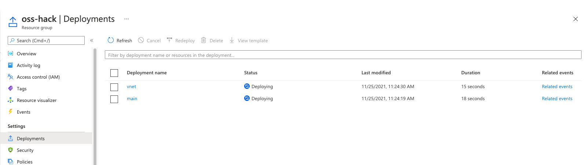
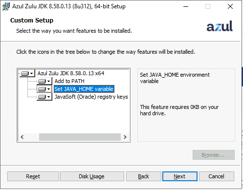

# 00 - Setup your environment

__This guide is part of the [migrate Java EE app and PostgreSQL database to Azure training](../README.md)__

Setting up all the necessary prerequisites in order to expeditiously complete the lab.

---
## Build Azure "on-premises" environment

Within your Azure subscription the Bicep template within this repository can be used to deploy
* Azure Linux VM - "oss-hack-pgsql" - to host the Pet Store Java application to WildFly and PostgreSQL database
* Azure Windows VM - "oss-hack-rdp" - to deploy the Pet Store Java application to both on-premises VM and into Azure
* Virtual Network - "oss-hack-vnet" - 10.0.0.0/16
  * Subnet - "PgSubnet" - 10.0.1.0/24
  * Subnet - "rdpSubnet" - 10.0.2.0/24

* To deploy the bicep template use Azure Cloud Shell 
    * Create an Azure Resource Group to deploy into (e.g. oss-hack)
    * Using Azure CLI (bash) create a folder called git
          ```bash
          mkdir git
          ```
    * Clone the git repo for this lab
        ```bash
          cd git
          git clone https://github.com/akdataai/migrate-java-db-to-azure.git
          ````
    * Navigate to the bicep folder 
        ```bash
        cd .scripts/bicep-vm/
        ```
    * Edit "./parameters/parameters.json" to reflect the resource group to deploy into and providing the login user and password for the VMs
        ```bash
        vi ./parameters/parameters.json
        ```
        ```text
          {
              "$schema": "https://schema.management.azure.com/schemas/2019-04-01/deploymentParameters.json#",
              "contentVersion": "1.0.0.0",
              "parameters": {
                  "resourceGroupName": {
                      "value": "oss-hack"
                  },
                  "namePrefix": {
                      "value": "oss"
                  },
                  "vmUsername": {
                      "value": "adminuser"
                  },
                  "vmPassword": {
                      "value": "Demo"pass1234567"
                  }
              }
          }
        ````
    * Run the Bicep template to deploy - specify the resource group name (-g resourceGroup)
        ```bash
        az deployment group create --template-file ./main.bicep  --parameters ./parameters/parameters.json -g "oss-hack"
        ```
    * The deployment progress can be checked using the Azure Portal
      * Navigate to the resource group and to the Deployments pane
           
* Following the successful Bicep deployment
    * Create a Network Security Group upon the PgSubnet with the following inbound rules
      * SSH - 22
      * WildFly Admin - 9990
      * Pet Store Application - 8080
      * PostgreSQL - 5432
    * Create an Azure Bastion to connect to "oss-hack-rdp"
      * Navigate to the VM
      * Select Connect and choose Bastion
      * Deploy Azure Bastion Service accepting the defaults to deploy into a new Subnet within the "oss-hack-vnet"

---
## Prerequisites

* Login to "oss-hack-rdp" 
  * The training lab requires the following to be installed on your development machine or deployed Azure Remote Desktop:
    * Install Edge Browser
      * direct download link [here](https://go.microsoft.com/fwlink/?linkid=2108834&Channel=Stable&language=en)
  
    * JDK 1.8
    *  Direct download link [here](https://cdn.azul.com/zulu/bin/zulu8.58.0.13-ca-jdk8.0.312-win_x64.msi)
      * As part of the installation select the option to set the JAVA_HOME
        * The step above will set the environment variable `JAVA_HOME` to the path of `javac` for this JDK installation.
  
  
  
    * Azure CLI
      * Direct download link [here](https://aka.ms/installazurecliwindows)
   
    * The Git Bash shell
      * Git Bash is pre-installed upon "oss-hack-rdp"
    
    * Maven
      * Direct download link [here](https://dlcdn.apache.org/maven/maven-3/3.8.4/binaries/apache-maven-3.8.4-bin.zip) 
      * Download and unpack to c:\maven
      * From the Start Menu search and launch "System Environment Variables"
      * Within the System Environment Variables section
      * Add to the PATH to the Maven Installation
        * c:\maven\apache-maven-3.8.4\bin
    
    
    * PostgreSQL Database tools (Optional):
      * [PostgreSQL CLI](https://www.postgresql.org/docs/current/app-psql.html)
    
    * The [`jq` utility](https://stedolan.github.io/jq/download/). 
        * Direct download link [here](https://github.com/stedolan/jq/releases/download/jq-1.6/jq-win64.exe)
        * Move the downloaded jq executable (jq-win64.exe) to the folder c:\jq
      * Launch Git Bash
        * Add an entry into the `~/.bashrc` file to set a launch alias for jq: 
       ```bash
      echo "alias jq=/c/jq/jq-win64.exe" > ~/.bashrc
      ```
      * Call the .bashrc file to source jq
      ```bash
      . ~/.bashrc
      ```
      
    * Using Git Bash download the Azure App Service for Java Source repository to c:/git
      ```bash
      mkdir /c/git/
      cd /c/git
      git clone https://github.com/akdataai/migrate-java-db-to-azure.git
      ````
    
    * Download and install Putty MSI
      * Direct download link [here](https://the.earth.li/~sgtatham/putty/latest/w64/putty-64bit-0.76-installer.msi)

---

➡️ Next guide: [01 - Deploy a Java EE application to VM](../step-01-deploy-java-ee-app-to-VM/README.md)
