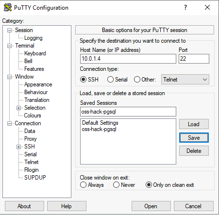
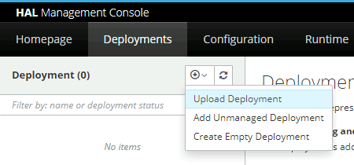
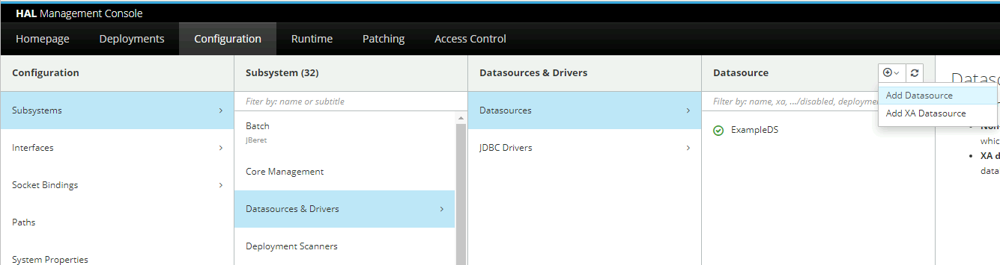
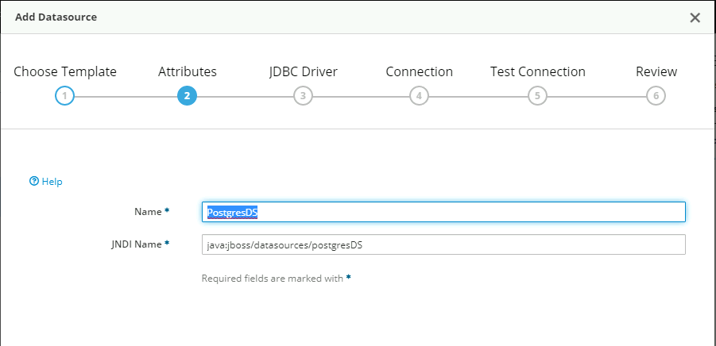
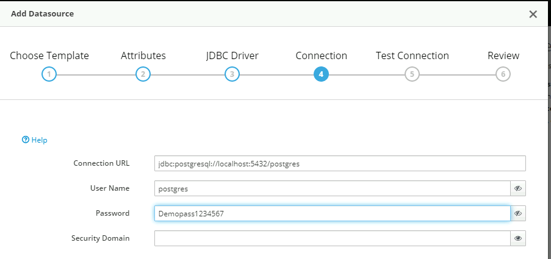
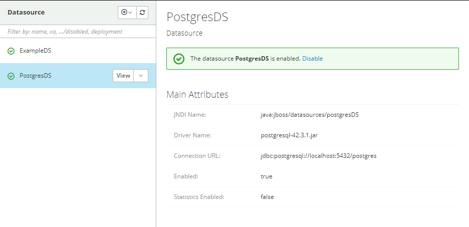
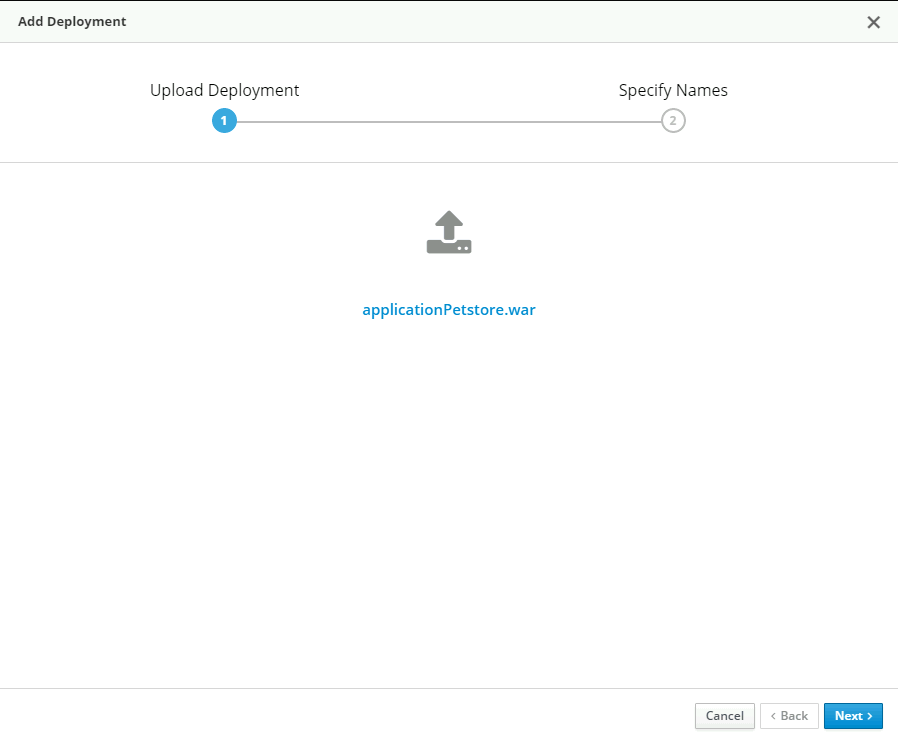

# 01 - Deploy a Java EE application to Azure VM

__This guide is part of the [migrate Java EE app to Azure training](../README.md)__

Basics on configuring Maven and deploying a Java EE application to Azure.

## Deploy Pet Store Application to Linux VM "oss-hack-pg"
    
* From the RDP "oss-hack-rdp" launch Putty and save a session for the oss-hack-pgsql VM
* Set the Hostname as 10.0.1.4
* Set the Session Name as "oss-hack-pgsql"
* Save the session 


* Select the saved session and hit Open
* Login to the VM us the username and password

* Prepare for WildFly installation
    * Sudo to root
        ```bash
        sudo su - 
        ```
    * Update the VM OS
        ```bash
        yum update -y 
        ```
    * Install Java 8 JDK
        ```bash
        yum install -y java-1.8.0-openjdk-devel
        java -version
        ```
    * Install wget
        ```bash
        yum -y install wget
        ```
    * Install WildFly 
        ```bash
        export WILDFLY_RELEASE="25.0.1"
        wget https://github.com/wildfly/wildfly/releases/download/25.0.1.Final/wildfly-25.0.1.Final.tar.gz
        tar xvf wildfly-$WILDFLY_RELEASE.Final.tar.gz
        mv wildfly-25.0.1.Final /opt/wildfly
        ```
    
   * Configure WildFly to run as a service within Linux
    	* Create a service user for Wildfly 
	    ```bash
	    sudo groupadd --system wildfly
	    sudo useradd -s /sbin/nologin --system -d /opt/wildfly  -g wildfly wildfly
	    ```
	
	*  Place WildFly Service scripts into /etc/wildfly and systemd area
	    ```bash
	    sudo mkdir /etc/wildfly
	    sudo cp /opt/wildfly/docs/contrib/scripts/systemd/wildfly.conf /etc/wildfly/
	    sudo cp /opt/wildfly/docs/contrib/scripts/systemd/wildfly.service /etc/systemd/system/
	    sudo cp /opt/wildfly/docs/contrib/scripts/systemd/launch.sh /opt/wildfly/bin/
	    sudo chmod +x /opt/wildfly/bin/launch.sh
	    sudo chown -R wildfly:wildfly /opt/wildfly
	    ```
  * Reload the Services Daemon and Start WildFly as a service
      ```bash
      sudo systemctl daemon-reload
      sudo restorecon -Rv /opt/wildfly/bin/
      setenforce 0
      sudo systemctl start wildfly
      sudo systemctl enable wildfly
      ```
      ```bash
      systemctl status wildfly
      ```
  * Check the WildFly service is running on port 8080
    ```bash
    ss -tunelp | grep 8080
    ```
    ```text	
      tcp   LISTEN 0      128          0.0.0.0:8080      0.0.0.0:*    users:(("java",pid=79152,fd=483)) uid:991 ino:358878 sk:10 <-> 
    ```
    
  * Add a WildFly Management User for the portal (example is below)
	  * Run the script /opt/wildfly/bin/add-user.sh 
      ```bash
      sudo /opt/wildfly/bin/add-user.sh
      ```
	  * Choose to add a Management user
	  * Provide a username
	  * Provide a password
	  * Leave the groups blank
	  * Confirm (yes) adding the user to the realm 'ManagementRealm'
	  * Confirm (yes) for the user to connect to the master or for a remote connection
        
      * Example execution
          ```text
           # sudo /opt/wildfly/bin/add-user.sh
              What type of user do you wish to add? 
              a) Management User (mgmt-users.properties) 
              b) Application User (application-users.properties)
              (a): a

              Enter the details of the new user to add.
              Using realm 'ManagementRealm' as discovered from the existing property files.
              
              Username : wildflyAdmin
              Password recommendations are listed below. To modify these restrictions edit the add-user.properties configuration file.
              - The password should be different from the username
              - The password should not be one of the following restricted values {root, admin, administrator}
              - The password should contain at least 8 characters, 1 alphabetic character(s), 1 digit(s), 1 non-alphanumeric symbol(s)
              Password : 
              WFLYDM0102: Password should have at least 1 non-alphanumeric symbol.
              Are you sure you want to use the password entered yes/no? yes
              
              Re-enter Password : 
              
              What groups do you want this user to belong to? (Please enter a comma separated list, or leave blank for none)[  ]: 
              About to add user 'WildflyAdmin' for realm 'ManagementRealm'
              Is this correct yes/no? yes
              
              Added user 'WildflyAdmin' to file '/opt/wildfly/standalone/configuration/mgmt-users.properties'
              Added user 'WildflyAdmin' to file '/opt/wildfly/domain/configuration/mgmt-users.properties'
              Added user 'WildflyAdmin' with groups  to file '/opt/wildfly/standalone/configuration/mgmt-groups.properties'
              Added user 'WildflyAdmin' with groups  to file '/opt/wildfly/domain/configuration/mgmt-groups.properties'
              
              Is this new user going to be used for one AS process to connect to another AS process? 
              e.g. for a slave host controller connecting to the master or for a Remoting connection for server to server Jakarta Enterprise Beans calls.
              yes/no? yes
              
              To represent the user add the following to the server-identities definition <secret value="RGVtb3Bhc3MxMjM0NTY3" />
          ```

  * Set WildFly path for login by adding the PATH in the bashrc file
      ```bash
      cat >> ~/.bashrc <<EOF
      export WildFly_BIN="/opt/wildfly/bin/"
      export PATH=\$PATH:/opt/wildfly/bin/
      EOF
      ```
   * Source the new PATH in your session
      ```bash
      source ~/.bashrc
      ```
   * Set WildFly to listen on all network devices
      ```bash
      vi /opt/wildfly/bin/launch.sh
      ```
      ```text
      $WILDFLY_HOME/bin/standalone.sh -c $2 -b $3 -bmanagement=0.0.0.0
      ```
  * Restart WildFly
    ```bash
    systemctl restart wildfly
    ```
  * Validate WildFly Admin Service is running on port 9990
      ```bash
      ss -tunelp | grep 9990
      ```
      ```text
      tcp   LISTEN 0      50           0.0.0.0:9990      0.0.0.0:*    users:(("java",pid=79152,fd=497)) uid:991 ino:358887 sk:13 <->  
      ```

* Deploy PostgreSQL 12
  * Install PostgreSQL 12
      ```bash
      sudo dnf -qy module disable postgresql
      sudo dnf -qy module enable postgresql:12
      sudo dnf -y install postgresql-server
      sudo dnf -y install postgresql-contrib
      ```
      
      * Initialise PostgreSQL 
      ```bash
      sudo postgresql-setup --initdb
      ```
      ```bash
      sudo systemctl start postgresql
      ```
      ```bash
      sudo systemctl enable postgresql
      ```

  * Configure PostgreSQL to listen and permit connections on all network devices
    * Edit the pg_hba.conf
    * Set IPv4 to accept connections from all addresses
    * Set the local and IPv4 connection method to trust (not ident)
    ```bash
    vi /var/lib/pgsql/data/pg_hba.conf
	        # TYPE  DATABASE        USER            ADDRESS                 METHOD
	        # "local" is for Unix domain socket connections only
	        local   all             all                                     trust
	        # IPv4 local connections:
	        host    all             all             0.0.0.0/0               trust
    ```
    
    * Configure PostgreSQL to listen on all addresses
      * Uncomment the listen_address parameter
      * Set the listen_address to * for all addresses
    ```bash
    vi /var/lib/pgsql/data/postgresql.conf
	        listen_addresses = '*'
    ```
    
    * Restart PostgreSQL
    ```bash
    sudo systemctl restart postgresql
    ```
    
    * Set the PostgreSQL default "postgresql" user password (example below uses the password Demopass1234567)
    ```bash
    psql -U postgres postgres
    ```
    ```bash
    postgres=# alter user postgres password 'Demopass1234567';
    postgres=# \q
    ```

    * Check connection to PostgreSQL
    ```bash
    psql "dbname=postgres host=10.0.1.4 user=postgres password=Demopass1234567 port=5432"
    ```

## Deploy Pet Store Application to WildFly and PostgreSQL

* From the Lab VM "oss-hack-rdp"
  * Download PostgreSQL JDBC driver to the Lab VM
  https://jdbc.postgresql.org/download/postgresql-42.3.1.jar

  * Using Edge browser, login to the Wildfly Admin Console
    http://10.0.1.4:9990

  * Create the PostgreSQL Data Source
    * Navigate to Deployments 
    * Select the PostgreSQL JDBC driver file (postgresql-42.3.1.jar)
    * Accept the Name and Finish


  * Navigate to 
    * Navigate to Configuration -> Datasources & Drivers
    * Add Data Source (not the XA)

      * Give the JNDI Name as:
        java:jboss/datasources/postgresDS

      * Select the PostgreSQL Driver (Downloaded above)

      * Set the connection URL to 
        jdbc:postgresql://localhost:5432/postgres
      * Set the Username to postgres
      * Set the password as set previously (e.g. Demopass1234567)

    * Test the connection is successful, review and deploy


  * Reload WildFly
    * Navigate to Runtime
    * Select the Server petstorevm
    * Select reload

# Package Pet Store application to deploy
  * Launch Git Bash session
  * Navigate to the git package
      ```bash
      cd /c/git/migrate-javaee-app-to-azure-training
      ```
  * Copy the PostgreSQL persistence file to the META-INF folder for deployment
      ```bash
      cp .scripts/persistence-postgresql.xml ./src/main/resources/META-INF/persistence.xml
      ```
  * Build the Pet Store WAR file using Maven for deployment
      ```bash
      mvn clean compile -Dmaven.test.skip=true
      ```
      ```bash
      mvn clean package -Dmaven.test.skip=true
      ```
      ```bash
      mvn clean install -Dmaven.test.skip=true
      ```

# Deploy Pet Store Application to Wildfly
  * Login to Administration Console
    http://10.0.1.4:9990
  * Add a new deployment
  * Select the application Petstore.war
    * c:\git\migrate-javaee-app-to-azure-training\target\applicationPetstore.war
  * Select next through to deploy


# In browser test the application is running:
  * Using Edge upon the RDP navigate to 
    http://10.0.1.4:8080/applicationPetstore/shopping/main.xhtml

# Check the deployment has populated the PostgreSQL database
  * Using psql from Git Bash connect to PostgreSQL and check the tables and records have been deployed 
      ```bash
      psql "dbname=postgres host=10.0.1.4 user=postgres password=Demopass1234567 port=5432"
      postgres=# \dt
                            List of relations
                Schema |        Name        | Type  |  Owner
                --------+--------------------+-------+----------
                public | category           | table | postgres
                public | country            | table | postgres
                public | customer           | table | postgres
                public | item               | table | postgres
                public | order_line         | table | postgres
                public | product            | table | postgres
                public | purchase_order     | table | postgres
                public | t_order_order_line | table | postgres
                (8 rows)
      postgres=# select * from customer;
      ```
---

⬅️ Previous guide: [00 - Prerequisites and Setup](../step-00-setup-your-environment/README.md)

➡️ Next guide: [02 - Create a database](../step-02-create-azure-postgresql-database/README.md)
