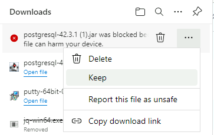
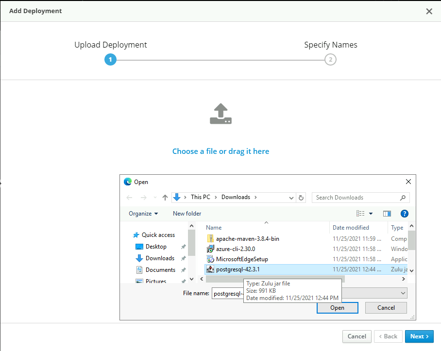
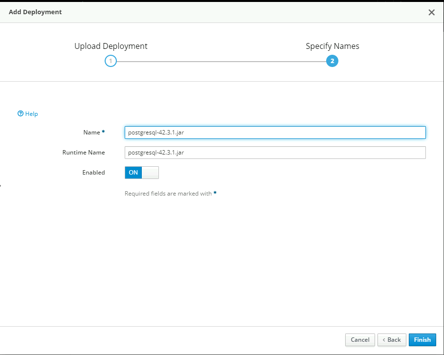

# 01 - Deploy a Java EE application to Azure VM

__This guide is part of the [migrate Java EE app to Azure training](../README.md)__

Basics on configuring Maven and deploying a Java EE application to Azure.

# Deploy Pet Store Application to Linux VM "oss-hack-pg"

## Prepare On-Premises Linux VM to host Pet Store Application and Database
    
* From the RDP "oss-hack-rdp" launch Putty and save a session for the oss-hack-pgsql VM
* Set the Hostname as 10.0.1.4
* Set the Session Name as "oss-hack-pgsql"
* Save the session 


* Select the saved session and hit Open
* Login to the VM us the username and password


  * Check the WildFly service is running on port 8080
    ```bash
    ss -tunelp | grep 8080
    ```

    The line below validates that port 8080 is being listened on
    ```text	
      tcp   LISTEN 0      128          0.0.0.0:8080      0.0.0.0:*    users:(("java",pid=79152,fd=483)) uid:991 ino:358878 sk:10 <-> 
    ```
    
  * A WildFly Management User has been added for the portal

    __This is hardcoded in the bootscript. Please do not do this in the real world. But for a workshop it expidited setup time for your convenience__
  
    [bootscript look for line add-user.sh for how it is done](../.scripts/bicep-vm/virtual-machines/vm-postgresql/bootstrap.sh)


  * Username: adminuser1
	* Password: password1!
	
  * If you wish to validate WildFly Admin Service is running on port 9990
    ```bash
    ss -tunelp | grep 9990
    ```
    ```text
    tcp   LISTEN 0      50           0.0.0.0:9990      0.0.0.0:*    users:(("java",pid=79152,fd=497)) uid:991 ino:358887 sk:13 <->  
    ```

  * __PGSQL has been configured for you as well with the hardcoded passwords below. DO NOT DO THIS IN REAL WORLD__
  * [Look in the bootscript for the lines about host based auth](../.scripts/bicep-vm/virtual-machines/vm-postgresql/bootstrap.sh)
  * [SQL Gist for adding a Postgres user with the password below](https://gist.githubusercontent.com/Sam-Rowe/50497dab992d6bc7a88bcb50828550ae/raw/b93d6ed9abafa7a183ac19bedf9c43f9a3e1bf19/SetPostgresUserAccountPassword.sql)
  * Check connection to PostgreSQL
    ```bash
    psql "dbname=postgres host=10.0.1.4 user=postgres password=Demopass1234567 port=5432"
    ```
  * Exit the psql client using "\q"


# Deploy Pet Store Application On-Premises to WildFly and PostgreSQL
* In this section we will deploy our Java Pet Store application to the on-premises VM. 
  * The steps below will:
    * Configure WildFly to talk with the on-premises PostgreSQL database.
    * Deploy the Pet Store Java application to run on WildFly, through the deployment the PostgreSQL database will be populated with data

* From the Lab VM "oss-hack-rdp"
  * Download PostgreSQL JDBC driver to the Lab VM
    Direct Download [here](https://jdbc.postgresql.org/download/postgresql-42.3.1.jar)
    Note. Edge will block the download using the elipses select "keep" (the JAR file is from a trusted source)


  * Using Edge browser, login to the Wildfly Admin Console
    http://10.0.1.4:9990

  * Deploy the PostgreSQL JDBC Driver to WildFly
    * Navigate to Deployments 
    * Click the Add button
    * Choose to upload a deployment
    * On the upload screen select the PostgreSQL JDBC driver file (postgresql-42.3.1.jar)
    * Accept the Name and Finish




  * When prompted reload WildFly
    * If there is no prompt reload manually in the console
      * Navigate to Runtime 
      * At the Server "oss-vm-pg" hit the drop down 
      * Select reload
  
  * Now create the PostgreSQL Data Source
    * Navigate to Configuration -> Datasources & Drivers
    * Add Data Source (not the XA)
    
 
     
    * Give the JNDI Name as
      ```text
      java:jboss/datasources/postgresDS
      ```
    
    
    * Select the PostgreSQL Driver (Downloaded above)
    
    
    * Set the connection URL to 
        ```text
        jdbc:postgresql://localhost:5432/postgres
        ```
    * Set the Username to postgres
    * Set the password as set previously (e.g. Demopass1234567)
    
    
    * Test the connection is successful, review and deploy
    

  * When prompted reload WildFly
    * If there is no prompt reload manually in the console
      * Navigate to Runtime
      * At the Server "oss-vm-pg" hit the drop down 
      * Select reload

## Package Pet Store Application to Deploy
  * Launch Git Bash session
  * Navigate to the git package
      ```bash
      cd /c/git/migrate-java-db-to-azure
      ```
  * Copy the PostgreSQL persistence file to the META-INF folder for deployment
    * The Persistence file contains pointers for WildFly to bind to our JDBC datasource (deployed above) and deploy the Pet Store schema and data

      ```bash
      cp .scripts/persistence-postgresql.xml ./src/main/resources/META-INF/persistence.xml
      ```
  * Build the Pet Store WAR file using Maven for deployment
      ```bash
      mvn clean compile -Dmaven.test.skip=true
      ```
      ```bash
      mvn clean package -Dmaven.test.skip=true
      ```
      ```bash
      mvn clean install -Dmaven.test.skip=true
      ```


## Deploy Pet Store Application to Wildfly
  * Login to Administration Console
    http://10.0.1.4:9990
  * Add a new deployment
  * Select the application Petstore.war
    * c:\git\migrate-java-db-to-azure\target\applicationPetstore.war
  * Select next through to deploy


  * Using Edge upon the RDP navigate to 
    http://10.0.1.4:8080/applicationPetstore/shopping/main.xhtml

## Check the deployment has populated the PostgreSQL database
  * Using psql from Putty connect to PostgreSQL and check the tables and records have been deployed 
      ```bash
      psql "dbname=postgres host=10.0.1.4 user=postgres password=Demopass1234567 port=5432"
      postgres=# \dt
                            List of relations
                Schema |        Name        | Type  |  Owner
                --------+--------------------+-------+----------
                public | category           | table | postgres
                public | country            | table | postgres
                public | customer           | table | postgres
                public | item               | table | postgres
                public | order_line         | table | postgres
                public | product            | table | postgres
                public | purchase_order     | table | postgres
                public | t_order_order_line | table | postgres
                (8 rows)
      postgres=# select * from customer;
      ```
---

⬅️ Previous guide: [00 - Prerequisites and Setup](../step-00-setup-your-environment/README.md)

➡️ Next guide: [02 - Create an Azure PostgreSQL database](../step-02-create-azure-postgresql-database/README.md)
