# 03 - Migrate on-premises PostgreSQL database to Azure

__This guide is part of the [migrate Java EE app and PostgreSQL database to Azure training](../README.md)__

# Azure Database for PostgreSQL pre-migration configuration
For expedience in this lab please allow Public access from any Azure resource
In a controlled environment the Azure PostgreSQL database would be created within a private virtual network with Network Security Rules in-place

---

# Deploy Azure Database Migration Service - Premium SKU
The Azure Database Migration Service can be used to perform an online migration for the on-premises PostgreSQL database to Azure Database for PostgreSQL.

To use the Azure Database Migration Service 
* Within your Resource Group
* Create the Database Migration Serivce resource 
    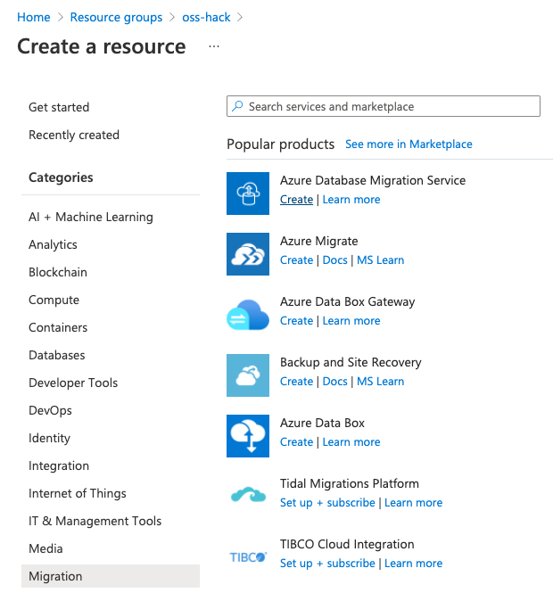
* Select the option to "Migrate my SQL Server, MySQL, PostgreSQL or MongoDB database(s) to Azure"
* Provide the "Migration Service Name" (e.g. oss-hack-pg-mig-svc)
* Choose the "Location" to be the same as your Azure Resource Group and Resources
* Change the "Pricing tier" to Premium 
    Note. Standard tier does not provide online migration capabilities
  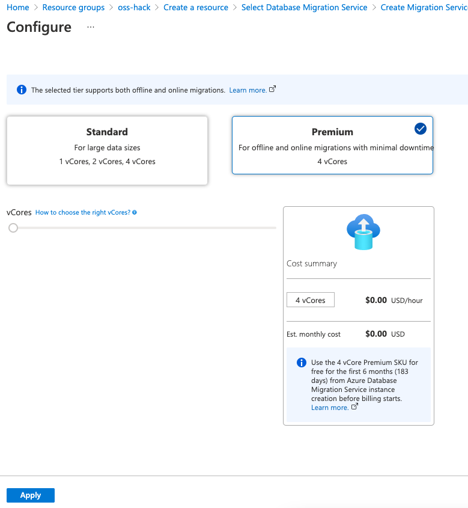
* Select Next to move onto the Networking settings
  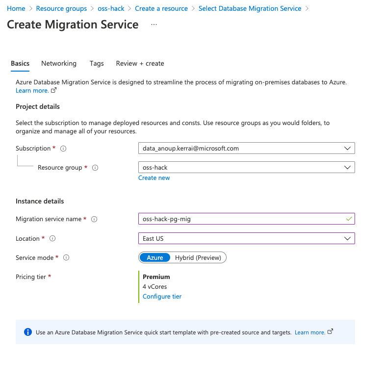
* Deploy the Migration Service into the on-premises PgSubnet virtual network
  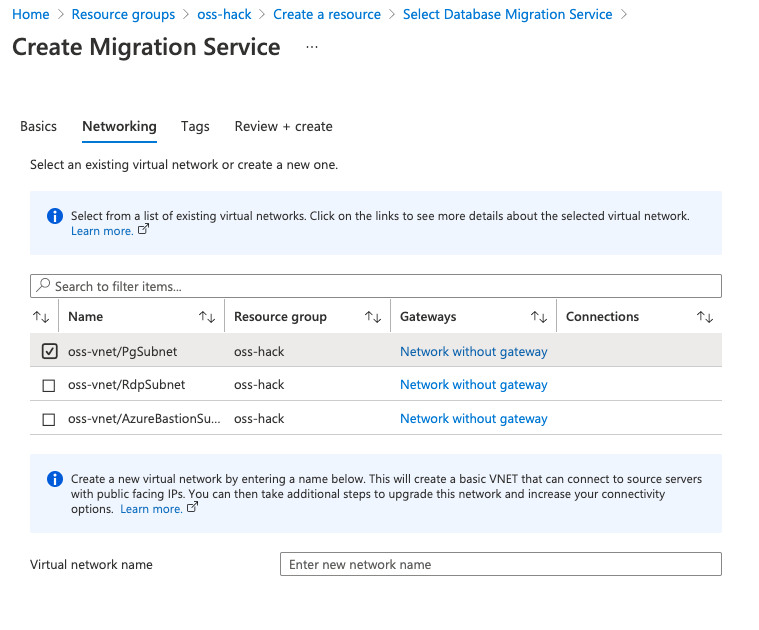
* Accept the defaults for the remaining options and deploy

# Setup Azure Database Migration Project
Within the Azure Database Migration Service
  * Create a new Migration Project for PostgreSQL
    * Provide the project a name
    * Set the source server type as PostgreSQL
    * Set the target server type as Azure Database for PostgreSQL
    * Leave the migration activity type as "Online data migration"

    * Note in order to migrate data first the schema definition must exist in the Azure PostgreSQL database. 
      * The Database Migration Service provides the instruction to do this using a PostgreSQL tool pg_dump to export the Database objects into a script
      * The output script must then be run into Azure Database for PostgreSQL to create the schema
      
      * From the RDP and "oss-vm-pgsql" Putty session
      * Export local Postgres schema into Azure Postgres
        ```bash
        pg_dump -h 10.0.1.4 -U postgres -d postgres -s > petstore_schema.sql
        ```
        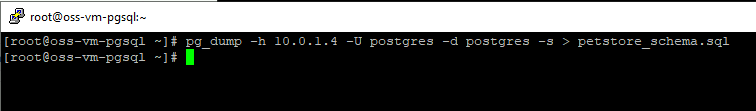

      * Import into Azure Database for Postgres
        * The connection string for the Azure PostgreSQL database can be found on the Azure Portal
        * Navigate to the Azure PostgreSQL database within your Resource Group
        * Navigate to the Connection Strings pane
        
        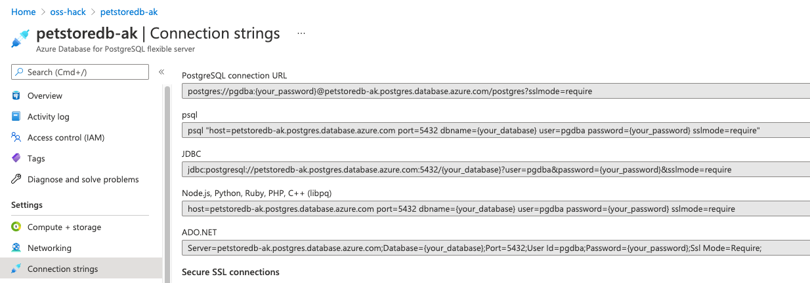
        
        * Copy the "psql" string
        * Paste into Putty and replace the dbname, user and password to match your Azure PostgreSQL Database details
        * Test the psql connection is successful
        * Quit psql
        
        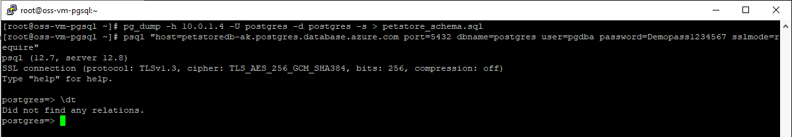
        
        * Now load the Pet Store Schema into the Azure PostgreSQL database using psql, inputting our schema file
          ```bash
          psql "host=petstoredb-ak.postgres.database.azure.com port=5432 dbname=postgres user=pgdba password=Demopass1234567 sslmode=require" < petstore_schema.sql
          ```
        
        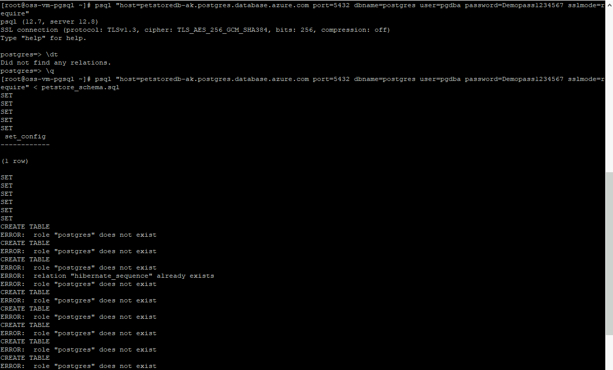


# Create Azure Database Migration Service Migration Project
Following the schema creation in Azure PostgreSQL continue to build the migration project
  * Set the Project name
  * Configure the source server type as PostgreSQL
  * Configure the Target server type as Azure Database for PostgreSQL
  * Select the Migration activity type as Online data migration
  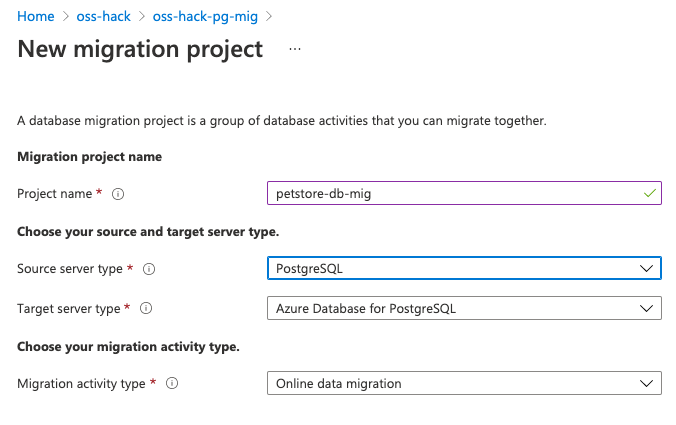

  * Select Create
  * Provide the Source Details
    * Source Server Name - Use the VM IP address (i.e. 10.0.1.4)
  * Provide the Server port
  * Provide the Database (i.e. postgres)
  * Provide the Username (i.e. postgres) 
  * Provide the Password 
  * As the on-premises PostgreSQL instance is not using SSL deselect the Encrypt connection option
    * Note. the Source database validation might fail if the parameter "wal_level" is not set the logical. 
    

        The wal_level determines how much information is written to the WAL. 
        The default value is replica, which writes enough data to support WAL archiving and replication, including running read-only queries on a standby server. 
        Minimal removes all logging except the information required to recover from a crash or immediate shutdown. 
        Logical adds information necessary to support logical decoding. 
      
  * Set the on-premises PostgreSQL wal_level parameter to logical, using psql, and restart:
    ```bash
    psql "dbname=postgres host=10.0.1.4 user=postgres password=Demopass1234567 port=5432"
    ALTER SYSTEM SET wal_level = logical;
    \q
    ```
  * Restart the PostgreSQL service
    ```bash
    sudo systemctl restart postgresql
    ```

    * Once the wal_level is set return to the Migration Wizard and Continue 
    * Configure the target Azure Database for PostgreSQL 
    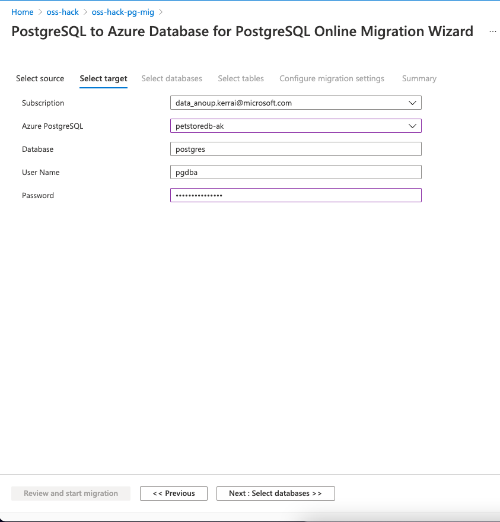

    * Select the database to migrate (i.e. postgres)
    * Select all eight tables to migrate

    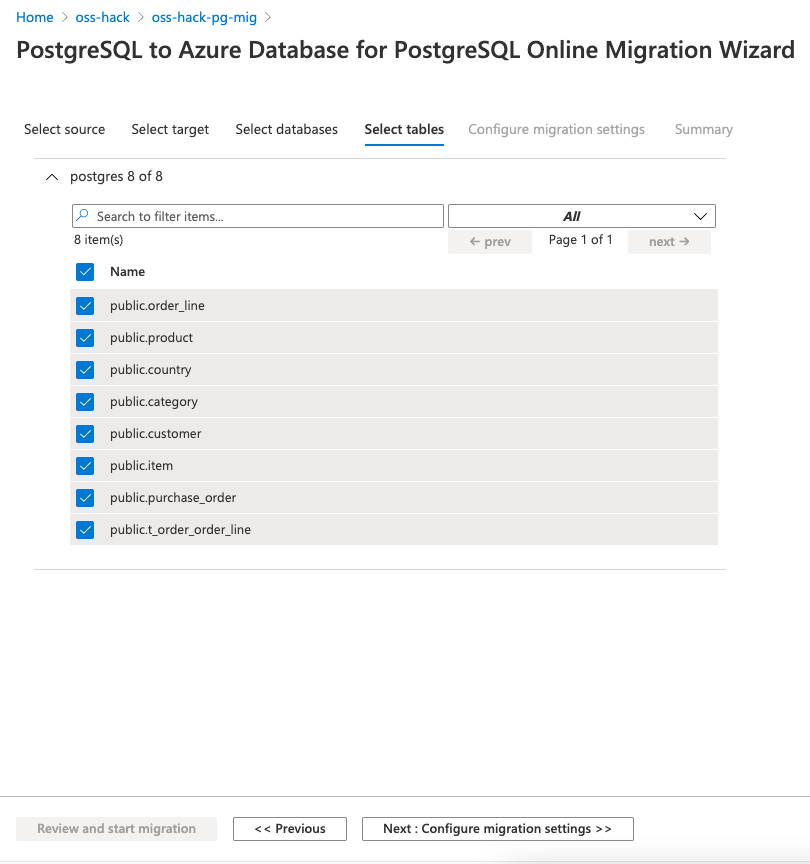

    * Continue through to the Summary and provide an activity name
    * Start the migration
    
  * Check migration job is successful and data has migrated into Azure Postgres
      ```bash
      psql "host=petstoredb.postgres.database.azure.com port=5432 dbname=postgres user=pgdba password=Demopass1234567 sslmode=require"
      ```
        
      ```bash
      postgres=> select * from customer;
            id  | date_of_birth |        email         | first_name |    city    | state |        street1        | street2 | zip_code | last_name | login  |                   password                   | role |    telephone     | uuid | vers
            ion | country_id
            ------+---------------+----------------------+------------+------------+-------+-----------------------+---------+----------+-----------+--------+----------------------------------------------+------+------------------+------+-----
            ----+------------
            1000 | 1935-07-01    | admin@petstore.com   | Admin      | CA         |       | The Admin Alley       |         | 87653    | Admin     | admin  | jGl25bVBBBW96Qi9Te4V37Fnqchz/Eu4qB9vKrRIqRg= |      | +1 123 3564 4567 |      |
            1 |       1230
            1001 | 1934-09-02    | user@petstore.com    | User       | CA         |       | The User Boulevard    |         | 87653    | User      | user   | BPiZbadjt6lpsQKO4wB1aerzpjVIbdqyEdUSyFud+Ps= |      | +1 123 3564 4567 |      |
            1 |       1230
            1002 | 1935-07-01    | anakin@skywalker.com | Anakin     | Black Star |       | 3 Wars Street         |         | 9999     | Skywalker | anakin | NwsSbfB4Wa+lac2CWCvEPfss47qAadu8vva3IVt6dsY= |      | +1 123 3564 4567 |      |
            1 |       1230
            1003 | 1914-04-02    | obiwan@kenobi.com    | Obi-Wan    | Black Star |       | 14 Star Boulevard     |         | 9999     | Kenobi    | obiwan | tNUFJEkJ96Dgu4quiEbgNxyEKJIaKUA4I7UziEIa6Kc= |      | +1 765 897 321   |      |
            1 |       1115
            1004 | 1951-09-07    | luke@skywalker.com   | Luke       | Black Star |       | 543 Sun Set Boulevard |         | 9999     | Skywalker | luke   | zM9S89A8UHLuZKE290/FayfgTxX/5dHSd9WKsY2Usyc= |      | +1 786 1212 987  |      |
            1 |       1200
            1005 | 1923-04-12    | han@solo.com         | Han        | Black Star |       | 543 Sun Set Boulevard |         | 9999     | Solo      | han    | wQaIooUS4VUGRcaf3xPnq2t07YcJS74B8o6IZJC3Ajk= |      | +1 786 1212 987  |      |
            1 |       1238
            (6 rows)
      ```
⬅️ Previous guide: [02 - Create Azure Database for PostgreSQL ](../step-02-create-azure-postgresql-database/README.md)
  
➡️ Next guide: [03 - Migrate on-premises application to Azure](../step-04-migrate-application-to-azure/README.md)

---