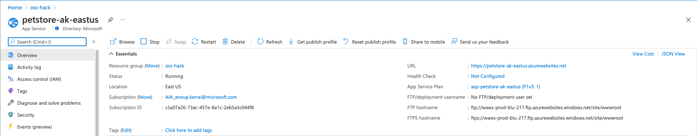
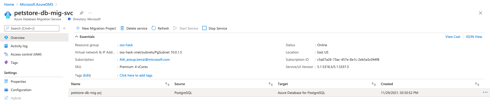
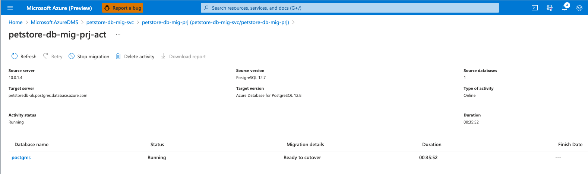
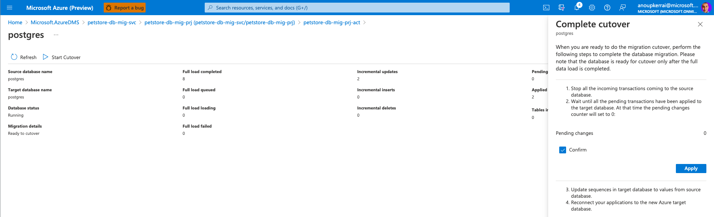

# 04 - Deploy a Java EE application to Azure App Service

__This guide is part of the [migrate Java EE app to Azure training](../README.md)__

Basics on configuring Maven and deploying a Java EE application to Azure.

---


## Configure PostgreSQL Data Source

There are 3 steps to configure a data source. These steps are similar to configuring data sources in any on premise Java EE app servers:

### Step 1: Understand how to configure JBoss EAP

In App Service, each instance of an app server is stateless. Therefore, each instance must be configured on startup to support a JBoss EAP configuration needed by your application. 

You can configure at startup by supplying a startup Bash script that calls [JBoss/WildFly CLI commands](https://docs.jboss.org/author/display/WFLY/Command+Line+Interface) to setup data sources, messaging
providers and any other dependencies. 

Within this repository in the folder ".scripts/3A-postgresql/" there is a pre-written bash startup.sh script. The startup.sh script calls upon "postgresql-datasource-commands.cli" that containing the JBoss/WildFly CLI commands. 

These two scripts are deployed to Azure App Service and then called upon by the App Service on startup to establish the connection to Azure Database for PostgreSQL.

## Source the development environment

Source the environment variables:
```bash
cd /c/git/migrate-java-db-to-azure
source .scripts/setup-env-variables.sh
```

# Configure application to deploy to Azure App Service
In this section we amend the persistence.xml file postgresql-datasource-commands.cli before they're deployed to Azure App Service as artifacts.

* Amend the persistence.xml to prevent the deployment dropping and recreating tables in Azure Database for PostgreSQL
  * Edit the file "./src/main/resources/META-INF/persistence.xml"
  
	```bash
	vi src/main/resources/META-INF/persistence.xml
	```
		Remove the lines
			<property name="javax.persistence.schema-generation.database.action" value="drop-and-create"/>
			<property name="javax.persistence.sql-load-script-source" value="init_db.sql"/>
  
    * Save the edit
		
* Amend the Azure Postgres datasource parameters within the ".scripts/3A-postgresql/postgresql-datasource-commands.cli" file

So it is a valid JDBC connection string to authenticate with Azure Database for PostgreSQL Flexible Server

  * Edit the postgresql-datasource-commands.cli file

	```bash    
	vi .scripts/3A-postgresql/postgresql-datasource-commands.cli
	```
  * Delete the data-source line

  * Replace with the data-source string below
  
	```bash
	data-source add --name=postgresDS --driver-name=postgres --jndi-name=java:jboss/datasources/postgresDS --connection-url=${POSTGRES_CONNECTION_URL,env.POSTGRES_CONNECTION_URL:jdbc:postgresql://db:5432/postgres} --use-ccm=true --max-pool-size=5 --blocking-timeout-wait-millis=5000 --enabled=true --driver-class=org.postgresql.Driver --exception-sorter-class-name=org.jboss.jca.adapters.jdbc.extensions.postgres.PostgreSQLExceptionSorter --jta=true --use-java-context=true --valid-connection-checker-class-name=org.jboss.jca.adapters.jdbc.extensions.postgres.PostgreSQLValidConnectionChecker
	```

* Edit the pom.xml file for the Maven Deployment into Azure App Service

Maven uses the pom.xml file to build the WAR file and record the artifacts/resources to deploy to Azure App Service.

  * For the Azure App Service Deployment we need to include our startup.sh script and postgresql-datasource-commands.cli
	* Edit the file "pom.xml"
  		```bash
		vi ./pom.xml
		```

	* Remove the "resources" lines within the "deployment" section, leaving the section empty.
	
	* Insert the <resources> lines below
	```xml
          <deployment>
            <resources>
              <resource>
                <type>war</type>
                <directory>${project.basedir}/target</directory>
                <includes>
                  <include>*.war</include>
                </includes>
              </resource>
              <resource>
                <type>lib</type>
                <directory>${project.basedir}/.scripts/3A-postgresql</directory>
                <includes>
                  <include>*.jar</include>
                </includes>
              </resource>
              <resource>
                <type>startup</type>
                <directory>${project.basedir}/.scripts/3A-postgresql</directory>
                <includes>
                  <include>*.sh</include>
                </includes>
              </resource>
              <resource>
                <type>script</type>
                <directory>${project.basedir}/.scripts/3A-postgresql</directory>
                <includes>
                  <include>*.cli</include>
                  <include>*.xml</include>
                </includes>
              </resource>
            </resources>
          </deployment>
	```

## Verify Azure Subscription and Deploy the Pet Store application to Azure App Service using Maven
* Ensure your Azure CLI is logged into your Azure subscription.

>💡 If using Windows, make sure you enter these commands and all others that follow in Git Bash.

```bash
az login # Sign into an azure account
az account show # See the currently signed-in account.
```

Ensure your default subscription is the one you intend to use for this lab, and if not - 
set the subscription via 

```bash
az account set --subscription ${SUBSCRIPTION}
```

* Configure the Azure App Service in the pom.xml for Maven
    * Run the maven command below to configure the Azure App Service plugin for Maven
  	```bash
	mvn com.microsoft.azure:azure-webapp-maven-plugin:1.16.1:config
	```
	* Supply the Azure Application name given in setup-env-variables.sh (e.g. petstore-<initial>-location)
    * Supply the Resource Group name
    * Supply the location
    * Accept the defaults for the app service plan
    * Confirm the settings
  


  * Maven will return the successful configuration
  
	```text
		[INFO] Scanning for projects...
		[INFO]
		[INFO] ----------------< org.agoncal.application:petstoreee7 >-----------------
		[INFO] Building Petstore application using Java EE 7 7.0
		[INFO] --------------------------------[ war ]---------------------------------
		[INFO]
		[INFO] --- azure-webapp-maven-plugin:1.16.1:config (default-cli) @ petstoreee7 ---
		[WARNING] The POM for com.microsoft.azure.applicationinsights.v2015_05_01:azure-mgmt-insights:jar:1.0.0-beta is invalid, transiti
		Please confirm webapp properties
		AppName : petstore-ak-eastus
		ResourceGroup : oss-hack
		Region : eastus
		PricingTier : P1v3
		OS : Linux
		Java : Java 8
		Web server stack: Jbosseap 7.2
		Deploy to slot : false
		[INFO] Saving configuration to pom.
		[INFO] ------------------------------------------------------------------------
		[INFO] BUILD SUCCESS
		[INFO] ------------------------------------------------------------------------
		[INFO] Total time:  01:46 min
		[INFO] Finished at: 2021-11-25T16:42:33Z
		[INFO] ------------------------------------------------------------------------
	```

* Once complete the pom.xml will be updated to include Azure App Service plugin
	
	```xml    
	<plugins> 

	<!--*************************************************-->
	<!-- Deploy to JBoss EAP in App Service Linux           -->
	<!--*************************************************-->

	<plugin>
		<groupId>com.microsoft.azure</groupId>
		<artifactId>azure-webapp-maven-plugin</artifactId>
		<version>1.16.1</version>
		<configuration>
		<schemaVersion>v2</schemaVersion>
		<subscriptionId>${SUBSCRIPTION}</subscriptionId>
		<resourceGroup>${RESOURCE_GROUP}</resourceGroup>
		<appName>${WEBAPP}</appName>
		<pricingTier>P1v2</pricingTier>
		<region>${REGION}</region>
		<runtime>
			<os>Linux</os>
			<javaVersion>Java 8</javaVersion>
			<webContainer>Jbosseap 7.2</webContainer>
		</runtime>
		<deployment>
			<resources>
			<resource>
				<directory>${project.basedir}/target</directory>
				<includes>
				<include>*.war</include>
				</includes>
			</resource>
			</resources>
		</deployment>
		</configuration>
	</plugin>
		...
	</plugins>
	```
## Build a Java EE application
Using Maven you can build and deploy the petstore application into Azure App Service
The deployment process will include creating an Azure App Service Plan and JBOSS Linux Web Application Service within the subscription and resource group defined in the setup-env-variables.sh

* Build the Petstore Application Package with the PostgreSQL database artifacts
```bash
mvn package -Dmaven.test.skip=true -Ddb=postgresql
mvn azure-webapp:deploy
```

	```text
	[INFO] Scanning for projects...
	[INFO]
	[INFO] ----------------< org.agoncal.application:petstoreee7 >-----------------
	[INFO] Building Petstore application using Java EE 7 7.0
	[INFO] --------------------------------[ war ]---------------------------------
	[INFO]
	[INFO] --- azure-webapp-maven-plugin:1.16.1:deploy (default-cli) @ petstoreee7 ---
	[WARNING] The POM for com.microsoft.azure.applicationinsights.v2015_05_01:azure-mgmt-insights:jar:1.0.0-beta is invalid, transitive dependencies (if any) will not be available, enable debug logging for more details
	Auth type: AZURE_CLI
	Default subscription: data_anoup.kerrai@microsoft.com(3b46a8b6-6973-49a5-88a2-750102251aad)
	Username: anoup.kerrai@outlook.com
	[INFO] Subscription: data_anoup.kerrai@microsoft.com(3b46a8b6-6973-49a5-88a2-750102251aad)
	[INFO] Creating web app petstore-ak-eastus...
	[INFO] Successfully created Web App petstore-ak-eastus.
	[INFO] Trying to deploy artifact to petstore-ak-eastus...
	[INFO] Deploying (C:\git\migrate-java-db-to-azure\target\applicationPetstore.war)[war]  ...
	[INFO] Deploying (C:\git\migrate-java-db-to-azure\.scripts\3A-postgresql\postgresql-42.2.5.jar)[lib]  to postgresql-42.2.5.jar ...
	[INFO] Deploying (C:\git\migrate-java-db-to-azure\.scripts\3A-postgresql\startup.sh)[startup]  ...
	[INFO] Deploying (C:\git\migrate-java-db-to-azure\.scripts\3A-postgresql\postgresql-datasource-commands.cli)[script]  to postgresql-datasource-commands.cli ...
	[INFO] Deploying (C:\git\migrate-java-db-to-azure\.scripts\3A-postgresql\postgresql-module.xml)[script]  to postgresql-module.xml ...
	[INFO] Successfully deployed the artifact to https://petstore-ak-eastus.azurewebsites.net
	[INFO] ------------------------------------------------------------------------
	[INFO] BUILD SUCCESS
	[INFO] ------------------------------------------------------------------------
	[INFO] Total time:  04:18 min
	[INFO] Finished at: 2021-11-25T17:03:08Z
	[INFO] ------------------------------------------------------------------------
	```

* Configure Azure App Service with the JDBC PostgreSQL connection parameters to Azure Database for Postgres
```bash
az webapp config appsettings set \
--resource-group ${RESOURCE_GROUP} --name ${WEBAPP} \
--settings \
POSTGRES_CONNECTION_URL=${POSTGRES_CONNECTION_URL}
```

	Ensure the correct connection URL, Username and Password is returned
	```text
	[
	{
		"name": "POSTGRES_CONNECTION_URL",
		"slotSetting": false,
		"value": "jdbc:postgresql://petstoredb.postgres.database.azure.com:5432/postgres?user=pgdba&password=Demopass1234567&sslmode=require"
	}
	]
	```


## Open Java EE application running on JBoss EAP in App Service Linux

* Navigate to the created App Service in the Azure Portal
* Click the URL to open a browser to the site


* Validate the Petstore Application is started
  * If the site does not load restart the App Service
  * Open a new browser window to the site
* Navigate to the Admin area
* Navigate to the customers to validate the data exists

* You can also get a JSON extract from the Azure App Service of customer data:
```bash
curl -X GET -H "accept: application/json" https://${WEBAPP}.azurewebsites.net/rest/customers
```
* Check the Java EE application's Swagger contract:
```bash
curl -X GET https://${WEBAPP}.azurewebsites.net/swagger.json
```

## Complete Cutover to Azure
At this point the Pet Store application data is being replicated from our on-premises database to Azure. The Application deployed into Azure is connected to the target Azure Database for PostgreSQL.

To cutover from on-premises to Azure
* Update a row in the on-premises data and validate the data change in the Azure App Service
  * Using psql connect to the on-premises database
	```bash
	psql "dbname=postgres host=10.0.1.4 user=postgres password=Demopass1234567 port=5432"
	```
  * Update a customer in the customer table
	```bash
	update customer set first_name='John; where id=1002;
	```
* Open a session to the Azure App Service
  * Navigate to the Admin area
  * Validate the customer change has replicated to Azure Database for PostgreSQL

* Once the data validation is complete 
  * Within the Azure Portal navigate to the deployed Database Migration Service
	

  * Navigate to the Database Migration Service Project
  
	

  * From here you can initiate cut over, by selecting "Start Cutover"
  * This will break the replication between the on-premises PostgreSQL database and Azure Database for PostgreSQL
	

# Congratulations You've Migrated a Java Application and PostgreSQL Database to Azure!
---

⬅️ Previous guide: [03 - Migrate on-premises PostgreSQL database to Azure ](../step-03-migrate-database-to-azure/README.md)
